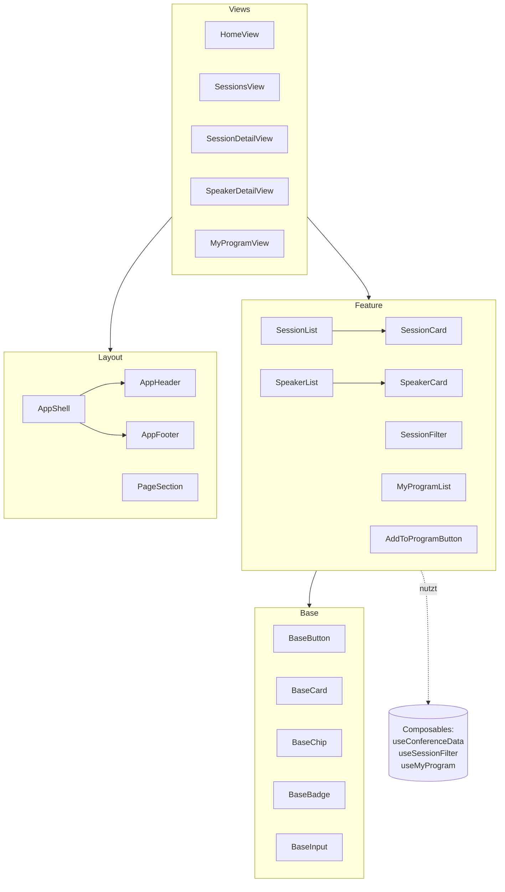

# ADR 01: Komponenten- & Ordnerstruktur

**Status:** angenommen · **Datum:** 07.10.2026

## Kontext

Unsere Plattform für die Konferenz „FrontendNow“ umfasst mehrere Seitentypen (Übersicht,
Session- und Speaker-Detailseiten, personalisiertes Dashboard „Mein Programm“). Zwei
Personen arbeiten parallel daran, und die Struktur muss Schritt 2–4 tragen. Wir brauchen
daher eine Ordnerstruktur, in der fachlich zusammengehöriger Code leicht auffindbar ist,
und klare Regeln, welche Komponente wovon abhängen darf.

## Optionen

1. **Gliederung nach Dateityp:** flache Ordner `components/`, `composables/`, `views/`.
   Einfach und Vue-Standard, aber bei wachsender App liegen Session-, Speaker- und
   Programm-Code vermischt in denselben Ordnern.
2. **Gliederung nach Feature + geteilte Basisschichten:** fachlicher Code liegt pro
   Bereich in `features/<bereich>/`, wiederverwendbare Bausteine in `components/base/`
   und `components/layout/`.
3. **Atomic Design** (Atoms, Molecules, Organisms, Templates, Pages): sehr feingliedrig,
   für unsere Projektgröße überdimensioniert. Die Zuordnung (Molecule oder Organism?)
   führt erfahrungsgemäß zu Diskussionen ohne echten Mehrwert.

## Entscheidung

Wir wählen **Option 2**.

```
src/
├─ main.ts
├─ App.vue
├─ router/index.ts
├─ styles/                 tokens.css, base.css
├─ data/                   conference-data.json
├─ types/                  conference.ts
├─ composables/            app-weit geteilte Logik (useConferenceData)
├─ components/
│  ├─ base/                Schicht Base/UI
│  └─ layout/              Schicht Layout
├─ features/               Schicht Feature
│  ├─ sessions/            components/, composables/
│  ├─ speakers/            components/
│  └─ my-program/          components/, composables/
└─ views/                  eine Seite pro Route
```

### Komponentenschichten

| Schicht | Ordner | Aufgabe | Regel |
|---|---|---|---|
| Base/UI | `components/base/` | rein visuelle Bausteine, Präfix `Base` | nur Props & Slots, kein Datenzugriff |
| Layout | `components/layout/` | Seitengerüst, Anordnung über Slots | keine Fachlogik |
| Feature | `features/<bereich>/` | fachliche Komponenten mit Daten & Logik | importiert nicht aus anderen Feature-Ordnern |
| Views | `views/` | setzen pro Route Layout & Features zusammen | kaum eigene Logik |

**Abhängigkeitsregel:** Imports zeigen nur nach unten:
`views → features → layout / base`. Geteilte Logik liegt in `composables/`.

### Komponentenübersicht



## Konsequenzen

- **Positiv:** Alles zu einem Bereich (z. B. „Mein Programm“) liegt an einer Stelle. Das
  erleichtert die Arbeitsteilung im Team und spätere Erweiterungen.
- **Positiv:** Base-Komponenten bleiben unabhängig von den Konferenzdaten und sind
  dadurch beliebig wiederverwendbar.
- **Positiv:** Die Abhängigkeitsregel verhindert zirkuläre Importe zwischen Features.
- **Negativ:** Für jeden neuen Baustein muss entschieden werden, ob er geteilt (base,
  layout, composables) oder feature-spezifisch ist.
- **Negativ:** Etwas tiefere Verzeichnisstruktur als bei Option 1.

## Headless-Prüfung: Session-Filterung

_TODO: wird im nächsten Schritt ergänzt._
