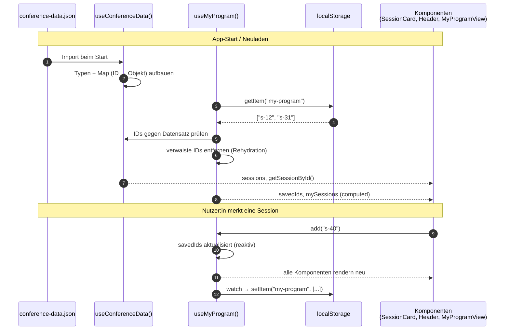

# State-Management-Konzept: „Mein Programm“ & conference-data.json

## Überblick

Wir unterscheiden zwei Arten von State:

| | Geteilter Datensatz | Persönlicher State „Mein Programm“ |
|---|---|---|
| Inhalt | alle Sessions, Speaker, Tracks | gemerkte Session-IDs |
| Quelle | `conference-data.json` | Klicks der Nutzer:innen |
| Veränderbar? | nein, nur lesen | ja |
| Persistenz | keine nötig | `localStorage` |
| Composable | `useConferenceData()` | `useMyProgram()` |

Beide Composables legen ihren State **außerhalb** der Funktion an (Modul-Ebene). Dadurch
gibt es ihn nur einmal, und jede Komponente, die das Composable aufruft, bekommt denselben
reaktiven State. Eine zusätzliche Bibliothek wie Pinia ist für diesen Umfang nicht nötig.

## Laden des Datensatzes: `useConferenceData()`

- **Wann:** Einmal beim App-Start. Die JSON-Datei wird über Vite direkt importiert und ist
  damit sofort verfügbar, ohne Ladezustand.
- **Modellierung:** Die Daten werden mit TypeScript-Typen beschrieben (`types/conference.ts`).
  Zusätzlich legen wir Nachschlage-Tabellen an (`Map` von ID → Objekt), damit z. B. eine
  Detailseite ihre Session direkt über `getSessionById(id)` findet, statt jedes Mal die
  ganze Liste zu durchsuchen.
- Der Datensatz ist **schreibgeschützt** (`readonly`). Keine Komponente kann ihn
  versehentlich verändern.

## Persönlicher State: `useMyProgram()`

### Datenstruktur: nur IDs

Im State und im `localStorage` speichern wir **nur die IDs** der gemerkten Sessions, z. B.
`["s-12", "s-31"]`. Die vollständigen Session-Objekte holen wir bei Bedarf aus dem
Datensatz:

```ts
const mySessions = computed(() =>
  savedIds.value.map(getSessionById).filter(Boolean)
)
```

**Begründung:** Der Datensatz bleibt die einzige Quelle der Wahrheit. Ändert sich dort z. B.
ein Raum, zeigt „Mein Programm“ automatisch den neuen Stand. Mit gespeicherten Kopien
würden veraltete Infos angezeigt. Außerdem bleibt der gespeicherte Wert klein und einfach.
Volle Objekte wären nur sinnvoll, wenn der Datensatz nicht immer verfügbar wäre (z. B.
offline mit externer API). Das ist bei uns nicht der Fall.

### Wann geladen und synchronisiert?

1. **Rehydration beim Start:** `useMyProgram` liest beim ersten Aufruf den Eintrag
   `my-program` aus dem `localStorage`. Fehlt er oder ist er beschädigt, starten wir mit
   einer leeren Liste (`try/catch`).
2. **Bereinigung:** IDs, die im Datensatz nicht mehr existieren (verwaiste IDs), werden
   herausgefiltert.
3. **Speichern:** Ein `watch` auf `savedIds` schreibt jede Änderung sofort zurück in den
   `localStorage`. Komponenten müssen sich ums Speichern also nicht kümmern.
4. **Mehrere Tabs (optional):** Über das `storage`-Event übernehmen wir Änderungen aus
   einem anderen Tab.

### Verteilung an Komponenten

Komponenten verändern den State nur über die Funktionen des Composables (`add`, `remove`,
`toggle`, `isSaved`). Weil alle denselben reaktiven State teilen, aktualisieren sich z. B.
der Button auf der Session-Karte, der Zähler im Header und die Liste in „Mein Programm“
gleichzeitig, ohne dass Daten über Props weitergereicht werden müssen.

## Datenfluss


